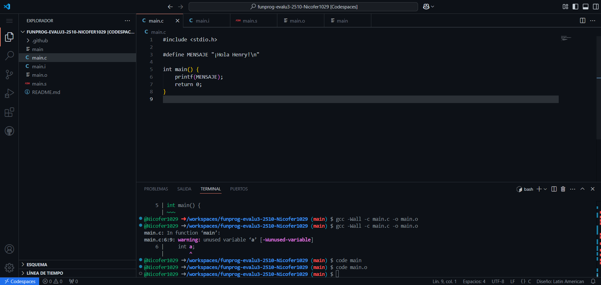
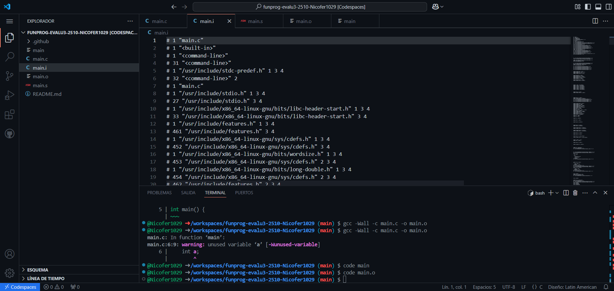
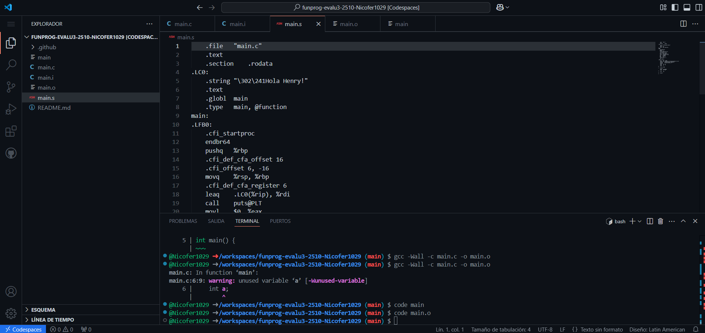
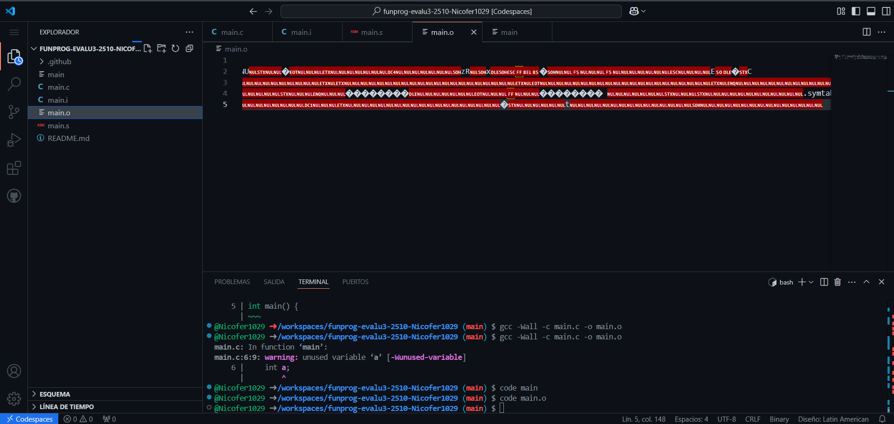
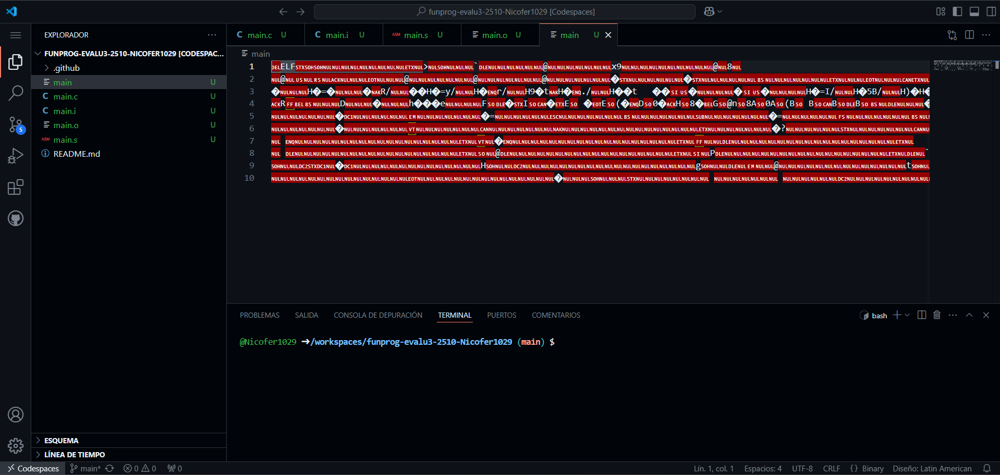

# 1. Visualizando cada etapa

## Codigo Fuente

- Este es el codigo fuente, esta escrito en c y es la base o el primer paso para empezar el proceso de compilación.

## Preprocesador

- Aqui iniciamos el proprocesador, lo que pude observar es que es un archivo muy extenso en comparacion a los otros archivos. Y si uno lo observa detalladamente se da cuenta efectivamente que se encarga de hacer sustituciones.

## Compilador

- Este vuelve a ser un archivo corto y de hecho se parece bastante al codigo fuente; solo que esta en un lenguaje muy diferente que no entendemos.

## Ensamblador

- El archivo esta en binario por lo que visual studio code, no nos puede mostrar el contenido del archivo, sin embargo nos da una pequeña visualizacion de caracteres raros.

## Linker

- Este es el ultimo paso del compilador, es un ejecutable .exe y al igual que el archivo .o del ensamblador, esta en binario, por lo que visual no nos puede mostrar el contenido, pero en este punto nuestro codigo en C, ya paso por todo el proceso de compilacion y esta listo nuestro ejecutable.

## Conclusiones sobre el proceso de compilacion

El proceso de compilacion en general, es sencillo solo hace uso de un comando y despues solo hay que cambiar la extencion del archivo. Sin embargo si me parece muy interesante lo que hay detras de los compiladores, porque no es solo darle al boton compilar y ya; sino conocer todo el proceso que debe hacer el computador para leer y compilar tu codigo en c y transformarlo varias veces hasta que sea un ejecutable.