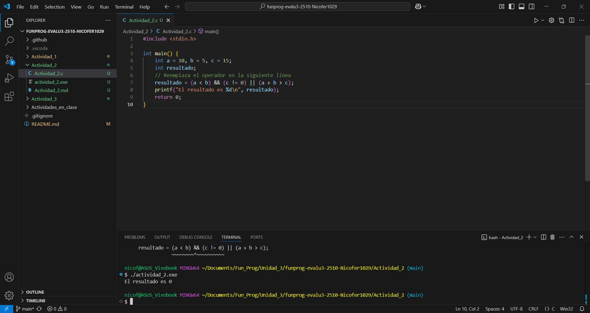
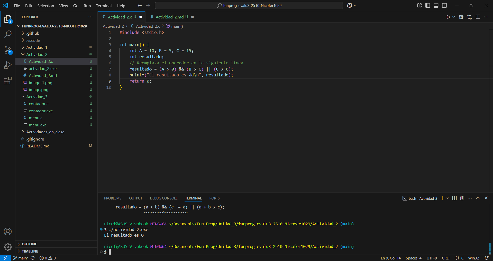
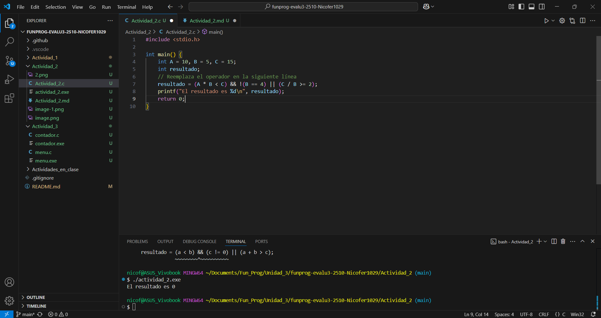
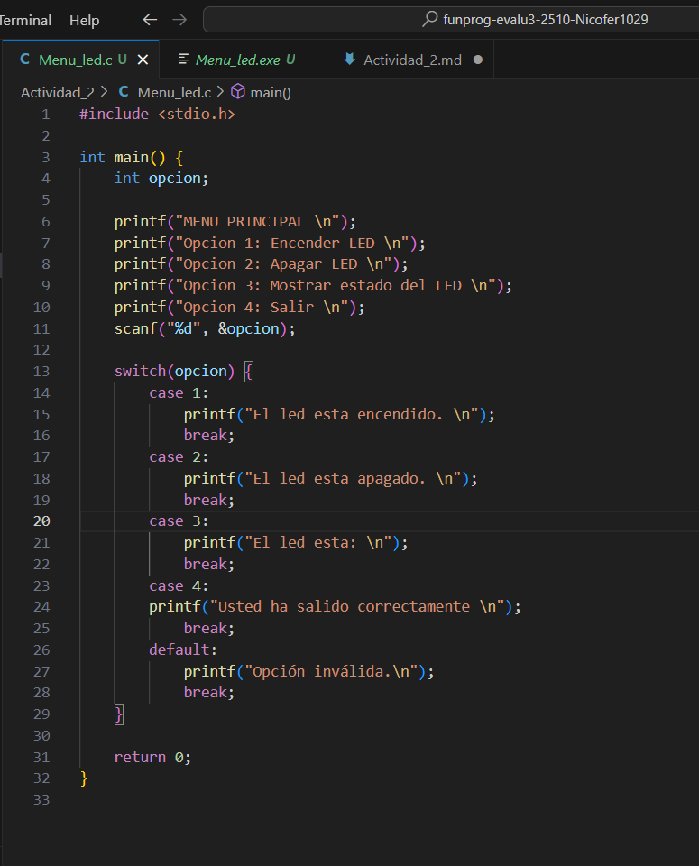
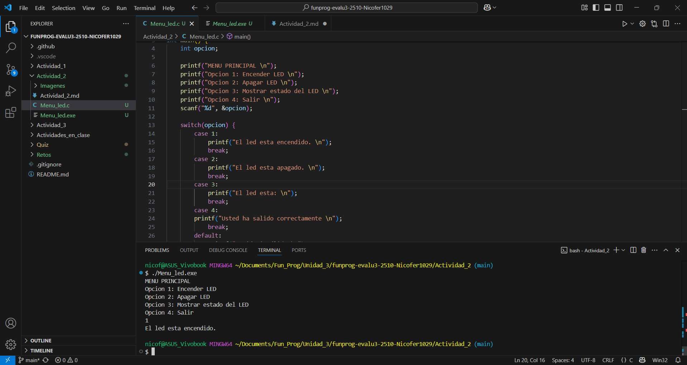
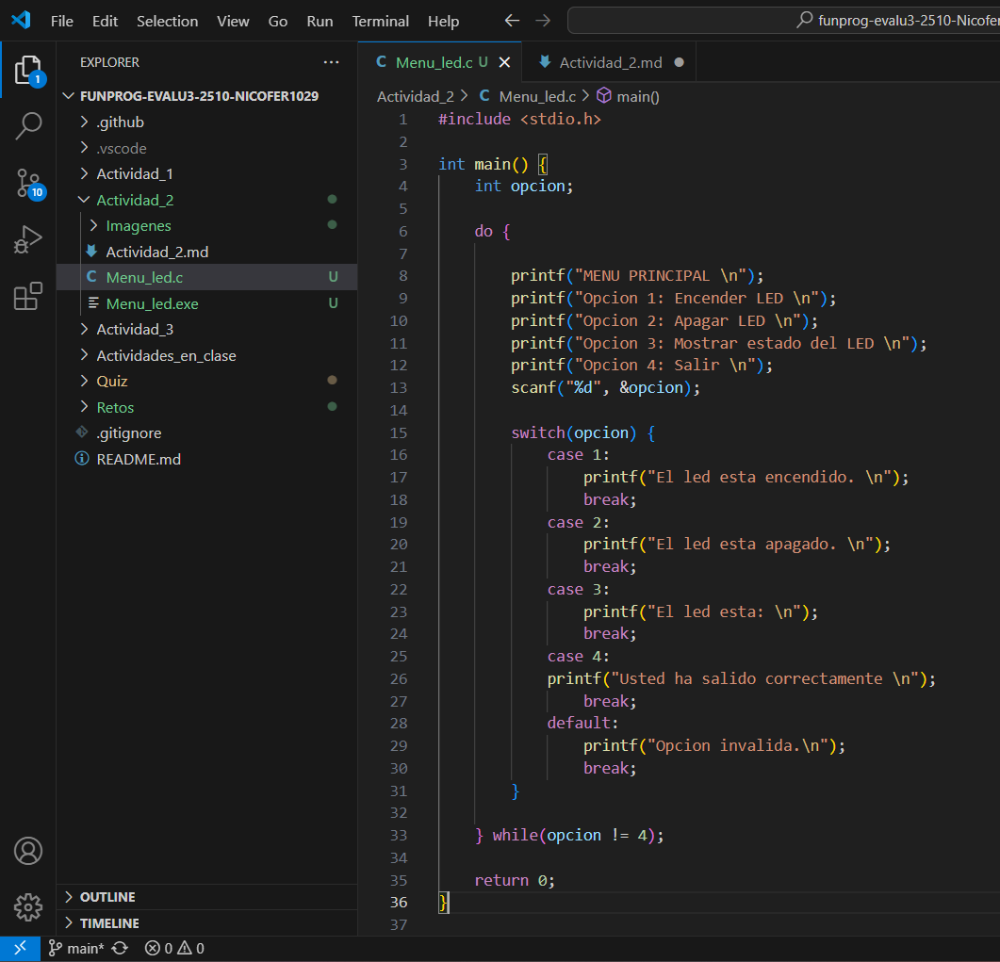
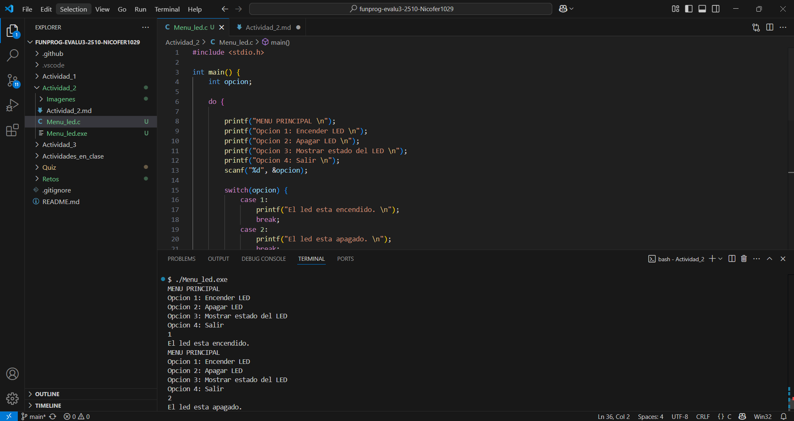
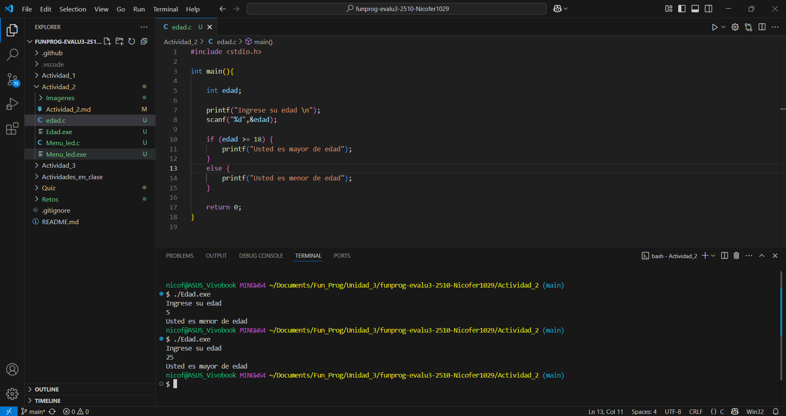
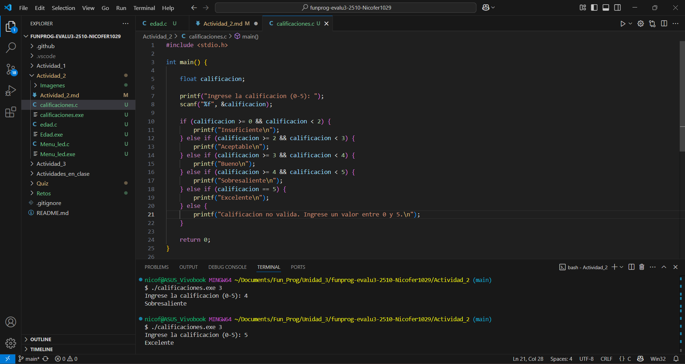

# 4. Actividad: Probando Operadores Relacionales

## Prueba 1

## Prueba 2

## Prueba 3

# 8. Ejercicio con switch

### Menu con diferentes opciones para un LED.

### Archivo compilado

### Menu con diferentes opciones para un LED y bucle do-while hasta que el usuario ingrese la opcion de salir.

### Archivo compilado

# 10. Ejercicios Propuestos

### Condicional doble: Escribe un programa que pregunte la edad y te indique si eres mayor o menor de edad.

### if-else if-else: Crea un programa que evalúe la calificación de un alumno (0-5) e imprima: "Insuficiente", "Aceptable", "Sobresaliente", etc.

### Menú repetitivo: Implementa un menú con al menos cuatro opciones y un bucle que permita seleccionar repetidamente cualquier opción hasta que se elija "Salir".